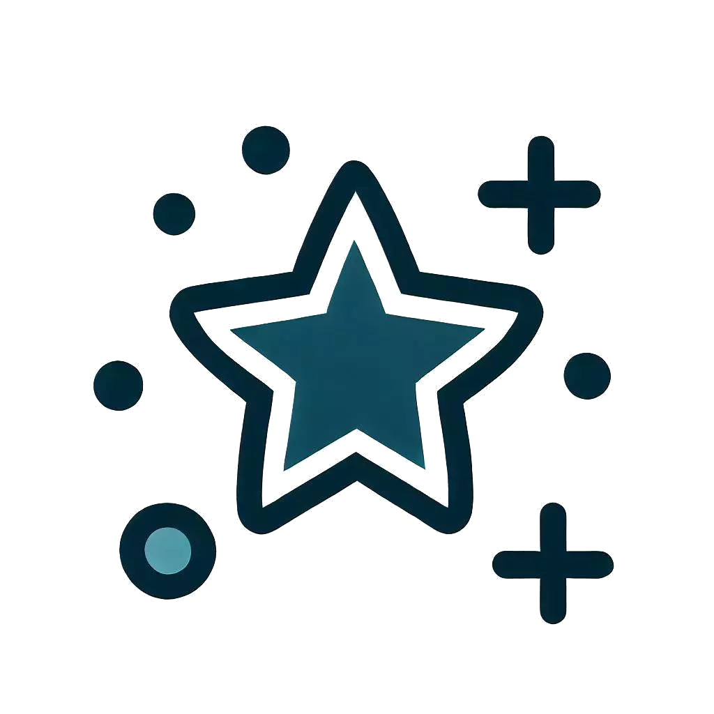

<div align="center">

# Starry Night



<div align="center">


</div>
<br/>

Craft personalized star constellation map posters by specifying a date, location, and adding a dedication text. Starry-Night seamlessly combines various technologies to deliver a unique and interactive experience for stargazers and astronomy enthusiasts.

</div>

## Key Features

- **Customized Constellation Maps:** Generate constellation maps tailored to your chosen date and location. Witness the stars as they appeared on any special night in your life.

- **Personalization:** Add a dedication text or message to make your starry creation truly unique. Perfect for commemorating special events or gifting to loved ones.

- **Print-Ready Posters:** Download high-resolution posters ready for printing, framing, or sharing on social media.

## Getting Started

To run Starry-Night locally or contribute to its development, follow these steps:

1. **Clone the Repository:**

   ```bash
   git clone https://github.com/ericjchang/starry-night.git
   ```

2. **Install Dependencies:**

   ```bash
   cd starry-night
   npm install
   ```

3. **Start the Development Server:**

   ```bash
   npm start
   ```

4. **Open the Application:**

   Visit `http://localhost:3000` in your web browser.

## Usage

1. **Input Date and Location:** On the Starry-Night homepage, provide a date and location for which you want to create a constellation map poster.

2. **Add Dedication Text:** Optionally, enter a dedication text that will appear on your poster.

3. **Generate Poster:** Click the "Generate Poster" button to create your personalized starry map.

4. **Explore and Download:** Interact with the constellation map, explore the night sky, and when you're satisfied, click "Download" to save your poster.

## Acknowledgements

- [React](https://reactjs.org/)
- [D3-Celestial](https://github.com/ofrohn/d3-celestial)
- [Google Maps JavaScript API](https://developers.google.com/maps/documentation/javascript/overview)

## About the Developer

Starry-Night is developed and maintained by [Eric J. Chang](https://github.com/ericjchang). Feel free to reach out with questions or feedback!
